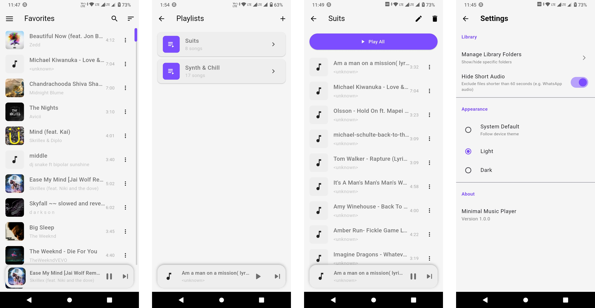

<div align="center">

  <h1>Minimal Music</h1>

  <p>
    <b>A clean, lightweight, and intuitive offline music player designed to help you enjoy your local music collection without distractions.</b>
  </p>

  <p>
    <a href="https://flutter.dev">
      
    </a>
    <a href="https://dart.dev">
      
    </a>
    <a href="LICENSE">
      
    </a>
  </p>
</div>

<br />

<!-- TABLE OF CONTENTS -->
<details>
  <summary>Table of Contents</summary>
  <ol>
    <li><a href="#about-the-project">About The Project</a></li>
    <li><a href="#screenshots">Screenshots</a></li>
    <li><a href="#key-features">Key Features</a></li>
    <li><a href="#tech-stack">Tech Stack</a></li>
    <li><a href="#getting-started">Getting Started</a></li>
    <li><a href="#license">License</a></li>
  </ol>
</details>

<br />

## About The Project

**Minimal Music** brings the focus back to what matters most: your music. In a world of cluttered apps and endless streaming options, Minimal Music offers a sanctuary for your local audio collection.

Manage your songs, curate playlists, and customize your listening experience with a simple, modern interface that stays out of your way. Whether you're commuting, working, or relaxing, Minimal Music ensures your tunes are just a tap away.

## Screenshots

Here's a sneak peek at the clean and user-friendly interface of Minimal Music.




## Key Features

Minimal Music is designed to provide a seamless listening experience:

*   🎵 **Local Playback**: Play audio files directly from your device storage with support for common formats.
*   📂 **Folder Management**: Scan and organize music from specific folders on your device.
*   🗂️ **Custom Playlists**: Create, manage, and organize your favorite tracks into playlists.
*   🔍 **Smart Search**: Quickly find songs, artists, or albums with an efficient search bar.
*   🎧 **Background Playback**: Keep the music playing while using other apps or when the screen is off, with full notification controls.
*   ⚙️ **Settings & Customization**: Manage app preferences and scan settings.
*   📊 **Clean Interface**: A distraction-free UI focused on your music.

## Tech Stack

This project is built using the following technologies:

*   [](https://flutter.dev/)
*   [](https://dart.dev/)
*   [](https://pub.dev/packages/provider)
*   [](https://pub.dev/packages/just_audio)
*   [](https://pub.dev/packages/shared_preferences)

## Getting Started

To get a local copy up and running, follow these simple steps.

### Prerequisites

*   **Flutter SDK**: Ensure you have Flutter installed on your machine.
    *   [Install Flutter](https://docs.flutter.dev/get-started/install)

### Installation

1.  **Clone the repo**
    ```bash
    git clone https://github.com/milanrnw/minimal_music.git
    ```

2.  **Navigate to the project directory**
    ```bash
    cd minimal_music
    ```

3.  **Install dependencies**
    ```bash
    flutter pub get
    ```

4.  **Run the app**
    Connect your device or start an emulator.
    ```bash
    flutter run
    ```

## License

Distributed under the MIT License. See `LICENSE` for more information.
